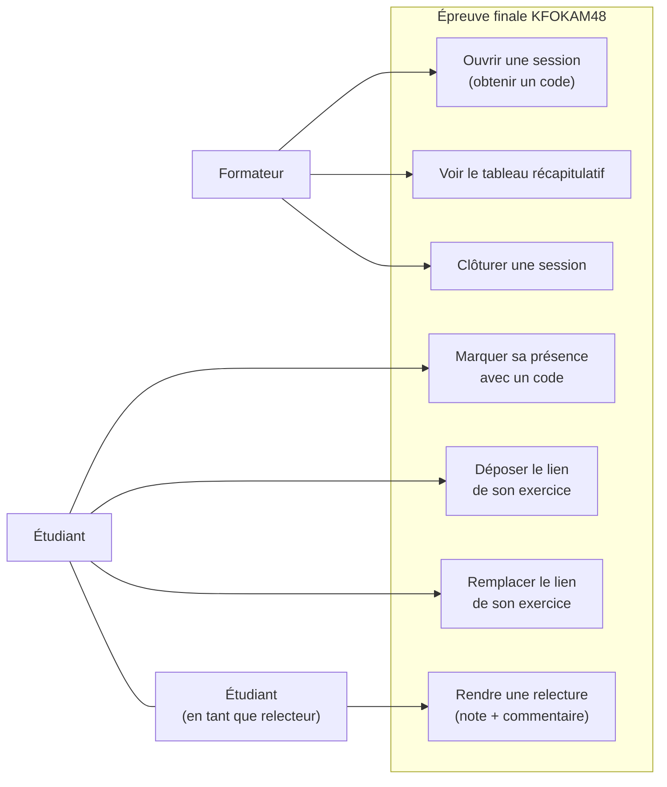

# D1 — Cas d'utilisation

Acteurs et ce que chacun peut faire. Le **relecteur n'est pas un acteur distinct** : c'est un
étudiant assigné dynamiquement à ce rôle sur un exercice donné (cf. cahier des charges §2 et RG5).

**Notes de lecture**

- Le relecteur est assigné automatiquement au dépôt d'un exercice (RG5), jamais sur son propre
  exercice (RG2).
- Il n'existe pas de cas d'usage « corriger sa relecture » : Q10 (correction possible avant clôture)
  a été écartée au profit de Q15 (note définitive dès l'envoi, cf. §7 et RG12). Une fois UC7 exécuté,
  la relecture est verrouillée.
- « Remplacer le lien » (UC6) est soumis à RG10 : possible tant que la relecture n'est pas rendue.
