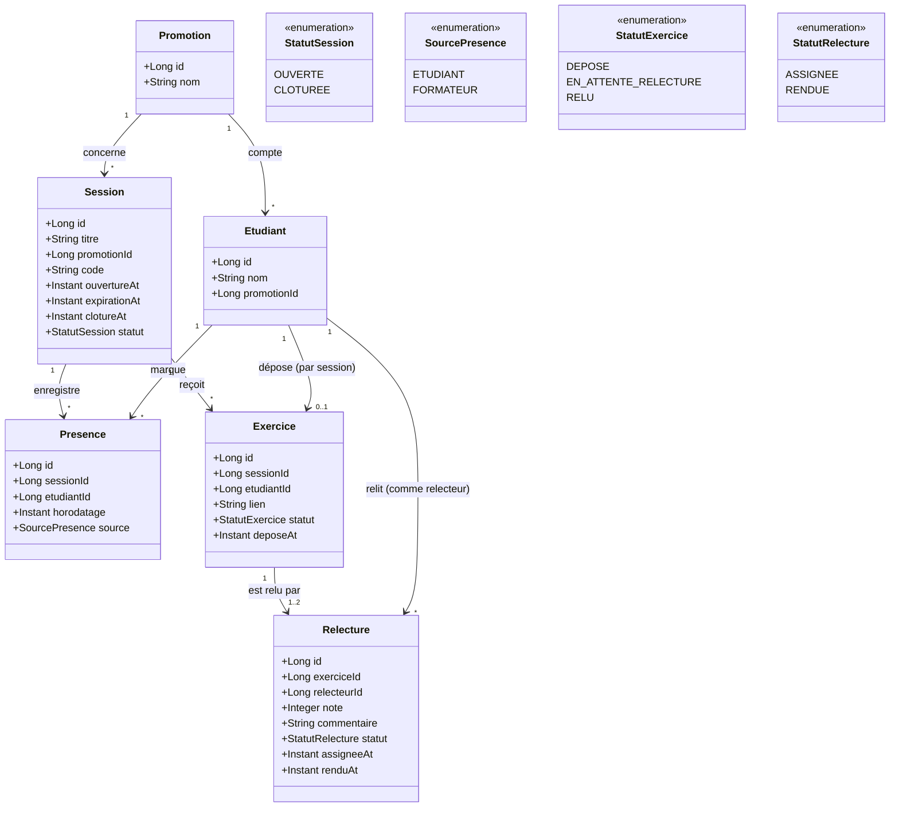

# D2 — Modèle de données

Les entités, leurs attributs et leurs cardinalités. **Doit correspondre aux migrations** : c'est le
cas de `V1__schema_initial.sql` et de `V3__deux_relecteurs_par_exercice.sql` — table par table,
colonne par colonne, contrainte par contrainte.

**Notes de lecture**

- Il n'existe **pas d'entité `Relecteur`** : un relecteur est un `Etudiant` référencé par
  `Relecture.relecteurId` (§2, RG5).
- L'unicité `(sessionId, etudiantId)` de `Presence` (ENF4) et l'unicité
  `(exerciceId, relecteurId)` de `Relecture` (RG4, **révisée à l'étape 3**) sont portées par la base,
  pas seulement par le service.
- **Jusqu'à deux relectures par exercice** depuis le changement de besoin de l'étape 3 : deux pairs
  distincts, jamais l'auteur, distincts entre eux. La cardinalité s'écrit `1..2` et non `2` parce
  qu'une session où un seul étudiant est éligible doit quand même produire une relecture — sa note
  restera provisoire (§7). Le modèle ne fait qu'autoriser la seconde ligne : c'est `RG4` révisée qui
  dit d'en tirer deux.
- RG2 (pas d'auto-relecture) ne s'exprime pas par une contrainte entre deux tables : elle reste
  contrôlée dans `RelectureService`.
