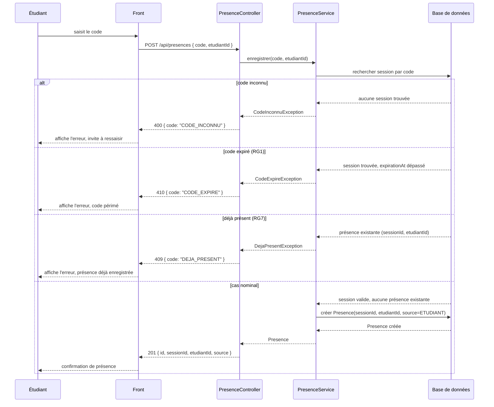

# D3 — Séquence : marquer sa présence

Cas nominal **et** les trois chemins d'erreur, alignés sur les codes HTTP du contrat (`api/contrat.yaml`).

**Notes de lecture**

- Le code expiré est refusé en **410** et le déjà-présent en **409** : ce sont les codes du contrat,
  pas un choix d'implémentation.
- Un quatrième refus existe, hors chemin nominal : après 5 échecs de code, le même étudiant est
  bloqué 2 minutes et reçoit **429 `TROP_DE_TENTATIVES`** (RG8, extension documentée en §7).
- Une session clôturée refuse toute nouvelle présence (RG13) : **409 `SESSION_DEJA_CLOTUREE`**.
