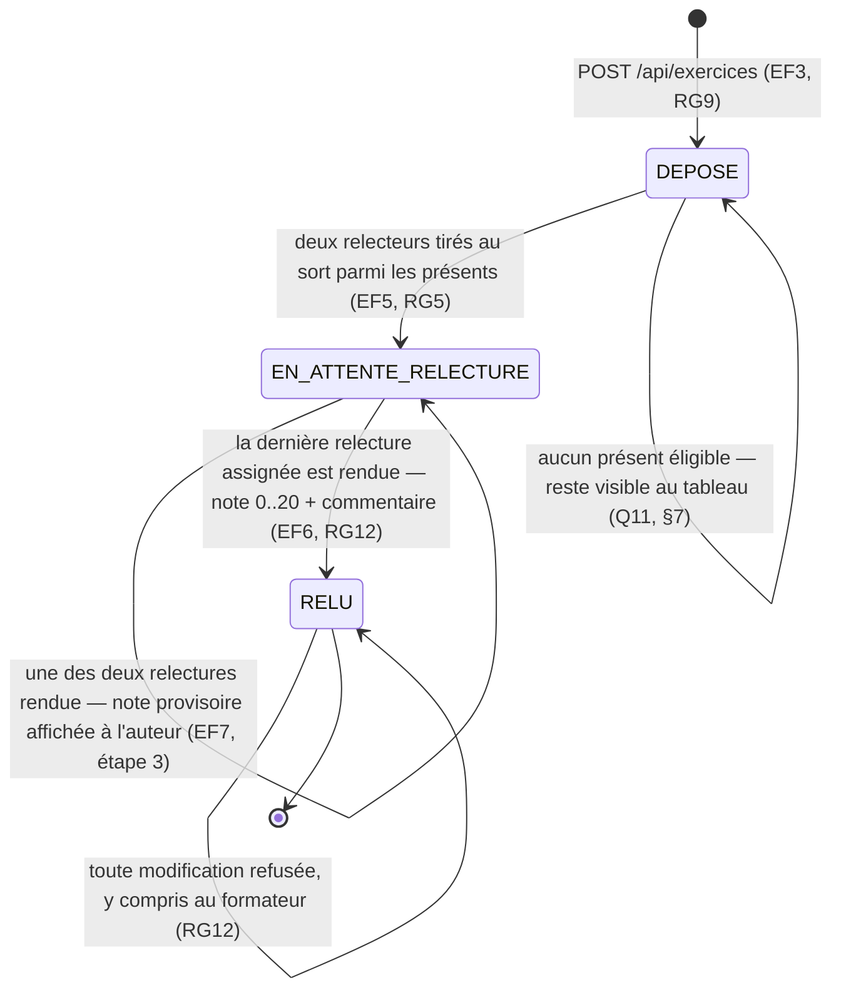

# D4 — États-transitions : cycle de vie d'un exercice *(bonus)*

Les trois états sont ceux de `StatutExercice` (cf. D2), donc exactement ceux que porte le code.

**Notes de lecture**

- **`RELUE` est un état terminal** : dès qu'une relecture est rendue, elle est définitive (Q15
  retenue contre Q10, cf. §7 et RG12). Aucune transition ne repart de `RELU`, et c'est volontaire.
- **Deux relectures depuis l'étape 3, donc deux boucles sur `EN_ATTENTE_RELECTURE`** : l'exercice n'y
  reste plus par accident, il y reste parce qu'il manque encore une note. `RELU` attend la **dernière**
  relecture assignée — avant elle, la note retenue existe mais elle est **provisoire** (§7).
- **Le lien se ferme plus tôt que l'exercice ne se termine** : `RG10` interdit de remplacer le lien dès
  la **première** relecture rendue, alors que l'état n'est encore que `EN_ATTENTE_RELECTURE`. Faire
  changer le travail sous les pieds d'un relecteur qui l'a déjà noté est le défaut que Q13 visait, et
  il ne dépend pas du nombre de relecteurs restants.
- **Le dépôt n'est pas conditionné par la présence** : on entre dans `DEPOSE` même sans avoir marqué
  sa présence — c'est le trou tranché en première ligne de la section 7.
- **`EN_ATTENTE_RELECTURE` ne garantit pas qu'une relecture arrive** : si les relecteurs ne rendent
  jamais, l'exercice y reste et le formateur doit le voir (Q11, RG14).
- La transition `DEPOSE --> DEPOSE` porte le cas « aucun étudiant présent éligible » (§7) : l'état
  `DEPOSE` couvre à la fois l'exercice fraîchement déposé et celui resté sans relecteur, faute d'un
  quatrième état que le modèle ne prévoit pas.
- **Le cas « un seul étudiant éligible » ne laisse pas l'exercice dans `DEPOSE`** : ce candidat est
  assigné, donc l'exercice entre bel et bien dans `EN_ATTENTE_RELECTURE`. Sa note restera provisoire,
  puisqu'aucun second relecteur n'existe — mais c'est le **nombre de relectures** qui diffère, pas la
  nature de l'état. Le modèle n'a donc pas besoin d'un état de plus.
