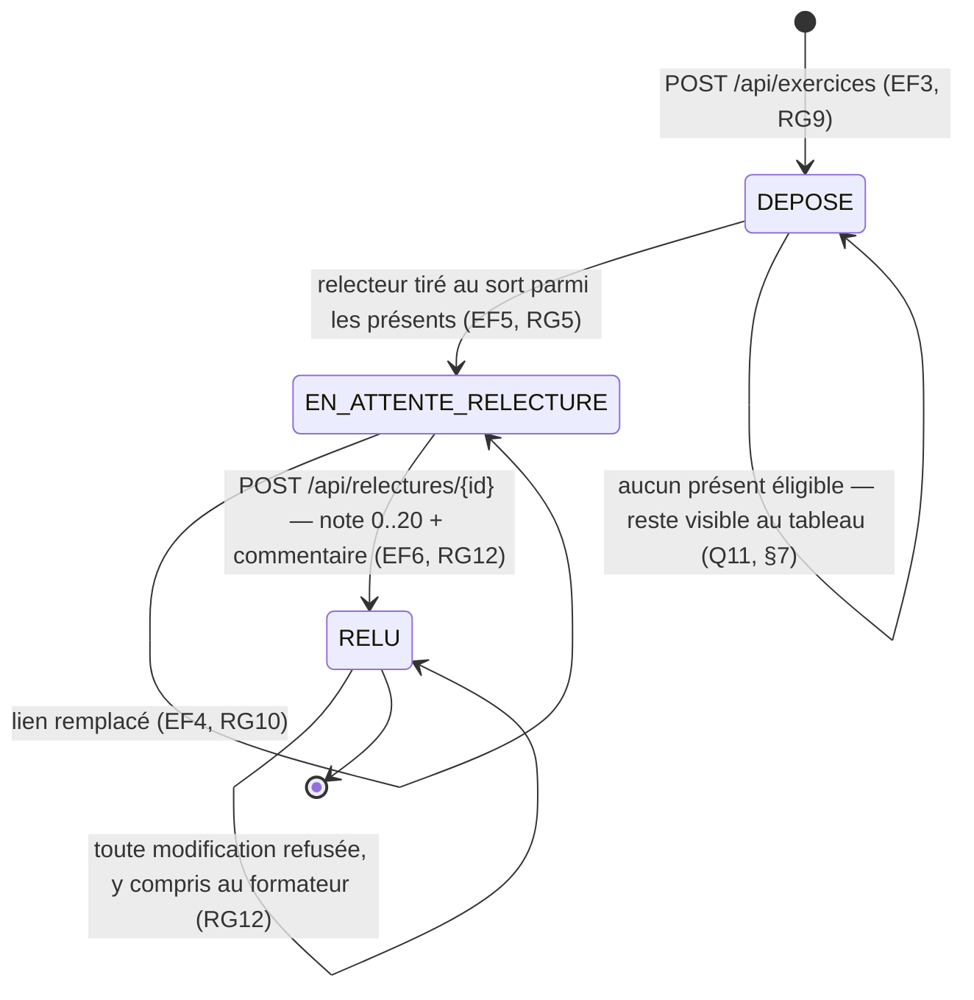

# D4 — États-transitions : cycle de vie d'un exercice *(bonus)*

Les trois états sont ceux de `StatutExercice` (cf. D2), donc exactement ceux que porte le code.

**Notes de lecture**

- **`RELUE` est un état terminal** : dès qu'une relecture est rendue, elle est définitive (Q15
  retenue contre Q10, cf. §7 et RG12). Aucune transition ne repart de `RELU`, et c'est volontaire.
- **Le dépôt n'est pas conditionné par la présence** : on entre dans `DEPOSE` même sans avoir marqué
  sa présence — c'est le trou tranché en première ligne de la section 7.
- **`EN_ATTENTE_RELECTURE` ne garantit pas qu'une relecture arrive** : si le relecteur ne rend
  jamais, l'exercice y reste et le formateur doit le voir (Q11, RG14).
- La transition `DEPOSE --> DEPOSE` porte le cas « aucun étudiant présent éligible » (§7) : l'état
  `DEPOSE` couvre à la fois l'exercice fraîchement déposé et celui resté sans relecteur, faute d'un
  quatrième état que le modèle ne prévoit pas.
